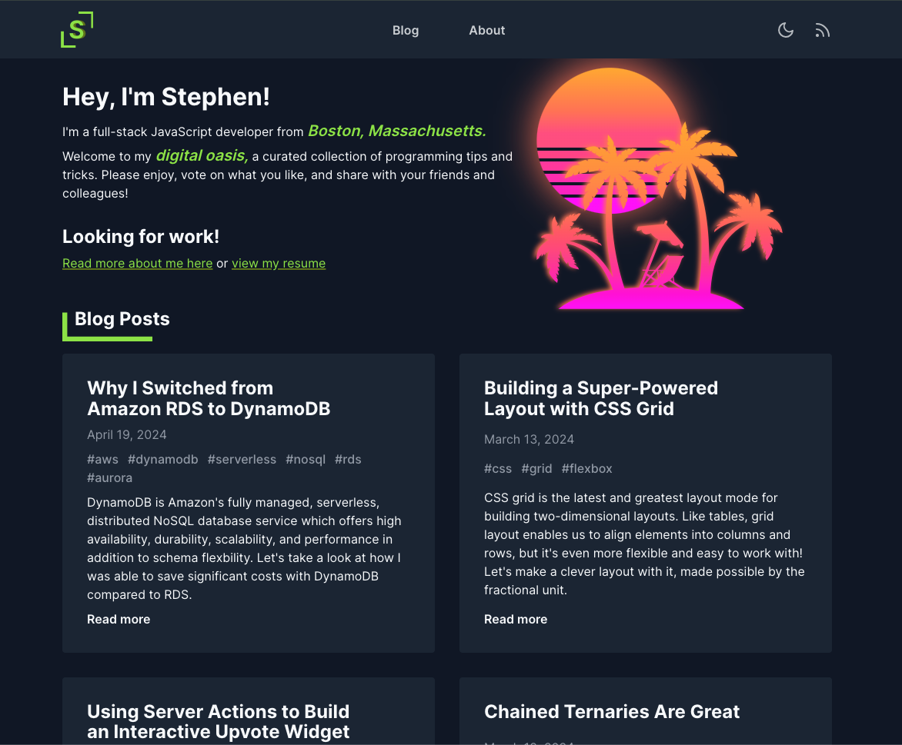

# StephenStPierre.com - My Personal Website and Developer Blog

Welcome to stephenstpierre.com, my own corner of the internet where I share my coding experiences, innovations with reproduceable demos, and opinions on a variety of topics related to web application development.

## [View the Production Build](https://stephenstpierre.com/)

<picture>
  <source media="(prefers-color-scheme: light)" srcset="packages/web/public/opengraph.png">
  
</picture>

## Navigation

- You can browse all posts on the Home page as well as the Blog page.
- You can view a filtered set of posts by clicking on any Tag related to a post.
- Each post has an interactive table of contents, allowing further ease of navigation within posts.
- Feel free to peruse the About page for more information about me.
- All of my social links, including email, are on the bottom right corner of every page.

## Additional Features

- Each post has a persisted number of views and "likes". You can "like" a post as many times as you wish by smashing the button on the right side of each post.
  - This feature is not yet available on mobile, but I have plans to add it.
- If you have a Light/Dark mode preference, you can toggle this using the navigation menu. Your preference will persist in the browser with Local Storage.
- If you prefer to use an RSS reader, you can subscribe to my RSS feed in the navigation menu.

## Engagement and Feedback

I love hearing from visitors, whether it's a question, suggestion, or really any kind of communication. You can contact me by email, using the Links section in the footer of each page.
